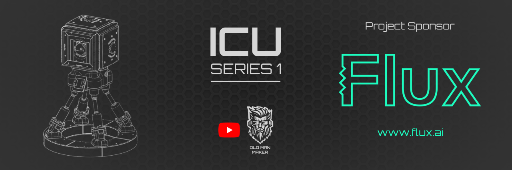

# ICU-S1 Robot
### Created by Brennon Williams | [@OldManMaker](https://youtube.com/@OldManMaker)

---

## 🤖 Project Overview

The **ICU-S1** is a model robot project featured on the **Old Man Maker** YouTube channel. It combines high-fidelity 3D printing with embedded vision AI to create an interactive robotic companion.

### Core Features
* **Vision System:** Integrated **OV5640 camera** running on a **Seeed Studio XIAO Sense ESP32**.
* **AI Capabilities:** Runs a local version of AI face detection (based on the Arduino sample project), allowing the robot to track and react to faces autonomously.
* **Lighting:** Features **3x RGB LED array PCBs**, each powered by an independent ATTiny85 chip (integrated into the PCB design).
* **Main Brain:** Powered by the **Unexpected Maker ProS3** board.

---

## 📂 Repository Structure

This repository is organized into three main distinct sections depending on which part of the robot you are building:

### 1. `/XIAO-Face-Detector`
Contains the source code for the **Seeed Studio XIAO Sense ESP32**.
* Handles the OV5640 camera driver.
* Runs the Edge Impulse / Arduino Face Detection model.
* Outputs coordinates/data to the main controller.

### 2. `/ICU-S1-Primary`
Contains the firmware for the **Unexpected Maker ProS3**.
* Handles motor control and robot behavior.
* Receives face tracking data from the XIAO Sense.

### 3. `/STLs`
Contains all 3D printable files required for the build.
* Files are organized into sub-folders by component assembly.

---

## 🔌 PCB Designs & Flux.ai

All PCB designs for this project are hosted on **Flux**. The Bill of Materials (BOM) for the boards is also contained inside the Flux projects.

**RGB LED Array:**
* **[View Project on Flux.ai](https://www.flux.ai/oldmanmaker/icus1-ledringv2?utm_source=influencer&utm_medium=organic_social&utm_campaign=oldmanmaker2)**

**How to manufacture:**
1.  Click the link above to view the project on Flux.
2.  **Fork** the project to your own workspace.
3.  Make any modifications you require.
4.  **Export the Gerber files** from the editor and send them to your preferred board manufacturer.

> **Manufacturing Note:** The boards were originally designed to be manufactured by PCBWay, but you can adjust the board settings in Flux to match your preferred manufacturer if needed.

---

## 🛠️ Bill of Materials (Partial)

### Microcontrollers
* **[Unexpected Maker ProS3](https://unexpectedmaker.com/shop.html#!/ProS3-D/p/759221737)** (Main Controller)
* **[Seeed Studio XIAO ESP32S3 Sense](https://www.seeedstudio.com/XIAO-ESP32S3-Sense-p-5639.html)** (Vision AI)

### Vision Hardware
* **[OV5640 Camera for XIAO](https://www.seeedstudio.com/OV5640-Camera-for-XIAO-ESP32S3-Sense-With-Heat-Sink-p-5739.html?srsltid=AfmBOor_foOtpM8gHuaP0-h70_UAPjHN5WI0JfUW2pxvrFGrzZ3m75iH)** (Includes heatsink)

### Chassis & Components
* **Custom 3D printed parts:** (See `/STLs` folder in this repo)
* **RGB LED PCBs:** (See Flux.ai link in section above)

*Note: Additional details regarding the specific hardware BOM will be added to this repository when possible.*

---

## 📜 License & Commercial Use

**This project is Open Source for Non-Commercial and Hobby use only.**

You are free to download, print, build, and modify the ICU-S1 for your own personal enjoyment and education.

**🚫 Commercial Restrictions:**
* You may **not** sell kits, printed parts, or finished units of this robot without express permission.
* You may **not** use derived works for commercial gain without express permission.

**🤝 Commercial Inquiries:**
If you are interested in selling parts of this project or creating derived works for commercial applications, please **open an issue in this repository** titled "Commercial Inquiry." We can discuss how to support your goals while ensuring the project's original creators and sponsors are respected.

---

## 🙏 Acknowledgments & Sponsors

A massive thank you to the sponsors who made this open-source project possible.

* **[Flux.ai](https://www.flux.ai/?utm_source=influencer&utm_medium=organic_social&utm_campaign=oldmanmaker2)** - For hosting the PCB designs and enabling collaborative hardware design.

---
*Maintained by Brennon Williams. Watch the build on [YouTube](https://youtube.com/@OldManMaker).*